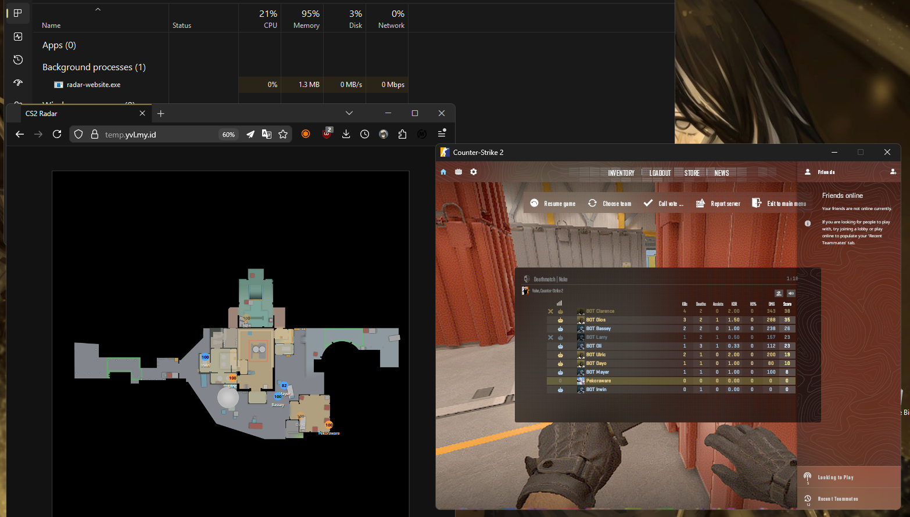

# cialan

 

world's worst windows cs2 web radar written in rust. *cialan luwh!*

## Setup (from source)

### 1. Rust
Make sure you have Rust toolchain instealled, duh.

### 2. Source2Viewer-CLI
Download cli from the [VRF releases](https://github.com/ValveResourceFormat/ValveResourceFormat/releases) and extract to `./.vrf`

### 3. Radar Dumper

1. Edit `radar-dumper.toml` and set `vpk_path` to your `pak01_dir.vpk` location.

   Default: `C:\Program Files (x86)\Steam\steamapps\common\Counter-Strike Global Offensive\game\csgo\pak01_dir.vpk`

2. Run `cargo run --bin radar-dumper --release`

### 4. Radar Website
1. Run `cargo run --bin radar-website --release`

2. Open `http://localhost:3000` in your browser.

### 5. TOML Files

There are `radar-dumper.toml`, `radar-reader.toml`, `radar-website.toml`. Feel free to configure them as needed.

`sleep_ms` in `radar-website.toml` is used to control how often it reads memory.

## Setup (prebuilt)

Prebuilt binaries are available on the [releases page](https://github.com/yuvlian/cialan/releases). 

1. Update `radar-website.toml` if you want to change the port or host.
2. Update `radar-reader.toml` if a game update breaks the current offsets/signatures.
3. Run `radar-website.exe`.
